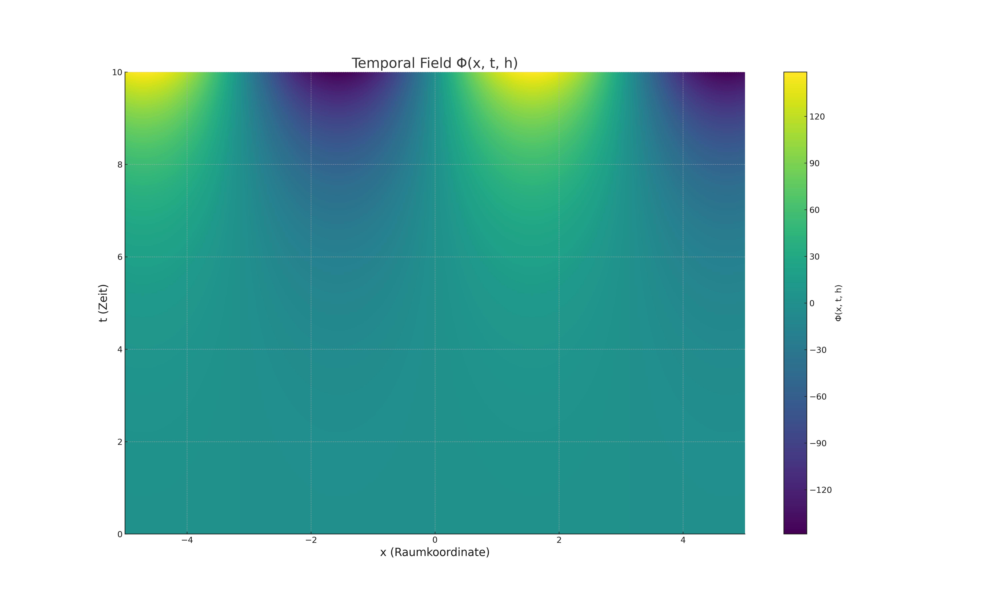
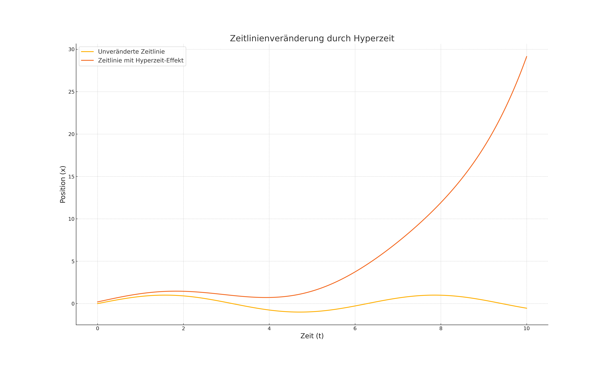

# Meta-Zeitraum-Modell (MZM): Eine Erweiterung der Raumzeit durch eine fünfte Dimension

---

## Zusammenfassung

Dieses Whitepaper führt das **Meta-Zeitraum-Modell (MZM)** ein, ein theoretisches Konzept, das die Existenz einer fünften Dimension – der Hyperzeit – postuliert. Dieses Modell erweitert die klassische Vorstellung der vierdimensionalen Raumzeit, indem es die Zeit als dynamisches und veränderbares Feld in einer übergeordneten Dimension beschreibt. Es bietet eine Grundlage für das Verständnis von Phänomenen wie Quantenverschränkung, Dunkler Energie und möglichen alternativen Zeitlinien. Das MZM ist konsiste...

---

## 1. Einführung

### 1.1 Problemstellung

Die klassische Physik behandelt Zeit als eine lineare Dimension innerhalb der Raumzeit, in der Ereignisse kausal miteinander verbunden sind. Diese Annahme erklärt jedoch nicht Phänomene wie:

- Die Quantenverschränkung, die scheinbar die Zeit- und Raumgrenzen überwindet.
- Die Dunkle Energie, deren Ursprung und Dynamik unklar sind.
- Theoretische Konzepte wie alternative Zeitlinien oder Multiversen.

### 1.2 Ziel des Meta-Zeitraum-Modells

Das MZM führt die Hyperzeit als eine zusätzliche, unabhängige Dimension ein. Diese erlaubt es:

1. Zeit als veränderbares Element in einem temporalen Feld zu modellieren.
2. Kausale und nicht-kausale Zusammenhänge innerhalb der Raumzeit aus einer übergeordneten Perspektive zu betrachten.
3. Indirekt nachweisbare Effekte der Hyperzeit vorherzusagen.

### 1.3 Methodik

- Analyse bestehender Theorien und Identifikation ihrer Schwächen.
- Entwicklung eines konsistenten mathematischen Frameworks für die Hyperzeit.
- Ableitung experimenteller Vorhersagen und praktischer Tests.

---

## 2. Bestehende Modelle und ihre Einschränkungen

### 2.1 Kaluza-Klein-Theorie

Die Kaluza-Klein-Theorie postuliert eine fünfte Dimension zur Vereinigung von Gravitation und Elektromagnetismus. Sie ist mathematisch elegant, hat jedoch wesentliche Einschränkungen:

- Die fünfte Dimension ist klein und kompakt (aufgerollt).
- Keine experimentellen Hinweise auf die Existenz der Kompaktifizierungsstruktur.

### 2.2 String-Theorie

Die String-Theorie beschreibt bis zu 11 Dimensionen, um alle fundamentalen Kräfte zu vereinheitlichen. Probleme sind:

- Komplexität und fehlende Überprüfbarkeit.
- Die Theorie liefert keine spezifischen Vorhersagen für beobachtbare Phänomene.

### 2.3 Many-Worlds-Interpretation

Diese Interpretation der Quantenmechanik postuliert alternative Universen für jede mögliche Entscheidung oder Quantenfluktuation. Probleme sind:

- Es gibt keine Erklärung für die Mechanismen hinter der Entstehung oder Verbindung dieser Universen.
- Fehlende experimentelle Nachweisbarkeit.

---

## 3. Das Meta-Zeitraum-Modell

### 3.1 Grundannahmen

Das MZM basiert auf den folgenden Annahmen:

1. Zeit ist eine lineare Dimension, in der Ereignisse kausal miteinander verbunden sind.
2. Die Hyperzeit ist eine fünfte Dimension, die eine übergeordnete Perspektive auf die gesamte Raumzeit ermöglicht.
3. Zeitlinien sind Strukturen in einem dynamischen, temporalen Feld innerhalb der Hyperzeit.

### 3.2 Mathematische Formulierung

Das MZM erweitert die klassische Einstein-Feldgleichung um eine Hyperzeitkomponente:
\[
G_{\mu\nu} + H_{\mu\nu} = T_{\mu\nu},
\]
wobei:

- \( G_{\mu\nu} \): Raumzeit-Geometrie (Einsteins Gravitationstensor),
- \( H_{\mu\nu} \): Wechselwirkungen der Hyperzeit,
- \( T_{\mu\nu} \): Energie-Impuls-Tensor.

Zusätzlich definiert das MZM ein **temporales Feld \( \Phi \)**, das die Hyperzeit beschreibt:
\[
\Phi(x,t,h) = \partial_t^2 x + h \partial_t x,
\]
wobei \( h \) ein Hyperzeit-Kopplungsparameter ist.

#### Beispiel: Zeitliche Fluktuationen im temporalen Feld

Angenommen, ein Objekt bewegt sich entlang einer Hyperzeit-Linie mit dem Parameter \( h \):
\[
x(t) = e^{ht},
\]
dann beschreibt die Hyperzeit-Komponente eine exponentielle Veränderung der Zeitkoordinaten. Diese ergibt sich aus der Ableitung des temporalen Feldes:
\[
\Phi(x,t,h) = h^2 e^{ht}.
\]

#### Beispiel: Energiefluss in der Hyperzeit

Die Energie eines Systems in der Hyperzeit wird durch die Wechselwirkung mit \( H_{\mu\nu} \) beschrieben:
\[
E_{\text{Hyperzeit}} = \int H_{\mu\nu} T^{\mu\nu} dV,
\]
wobei \( dV \) das Hyperzeit-Volumen beschreibt.

### 3.3 Physikalische Interpretation

1. **Zeitlinien:** Zeitlinien sind Ströme im temporalen Feld \( \Phi \), die durch Wechselwirkungen in der Hyperzeit beeinflusst werden können.
2. **Veränderungen in der Zeit:** Veränderungen in der Hyperzeit führen zu Modifikationen der Zeitlinien, die sich in der Raumzeit als Anomalien manifestieren.
3. **Kausalität:** Kausalität bleibt innerhalb der Raumzeit lokal intakt, wird jedoch in der Hyperzeit flexibel.

### 3.4 Illustrationen

#### Illustration 1: Temporales Feld \( \Phi(x, t, h) \)

Diese Grafik zeigt das temporale Feld \( \Phi(x, t, h) \) als eine Funktion von Raum \( x \) und Zeit \( t \), beeinflusst durch den Hyperzeit-Kopplungsparameter \( h \). Die Konturen stellen Fluktuationen dar, die durch Hyperzeit-Effekte entstehen.

#### Illustration 2: Zeitlinienveränderung

Diese Grafik vergleicht eine unveränderte Zeitlinie mit einer durch Hyperzeit-Effekte veränderten Zeitlinie. Die Unterschiede zeigen den Einfluss des temporalen Feldes auf die Zeitdimension.

---

## 4. Experimentelle Ansätze

### 4.1 Präzise Zeitmessungen

- Hochpräzise Atomuhren können Schwankungen im Zeitfluss aufzeigen, die durch Hyperzeit-Effekte verursacht werden könnten.
- Hypothese: Diese Anomalien treten in stark gravitierenden oder extrem energiearmen Regionen auf.

### 4.2 Quantenmechanik

- Tests mit Quantenverschränkung könnten Hinweise auf Hyperzeit-Wechselwirkungen liefern.
- Hypothese: Verschränkte Teilchen zeigen Abweichungen von etablierten Korrelationen.

### 4.3 Kosmologische Beobachtungen

- Die Expansionsrate des Universums könnte durch Effekte der Hyperzeit beeinflusst sein.
- Hypothese: Unregelmäßigkeiten in der kosmischen Mikrowellen-Hintergrundstrahlung (CMB) könnten auf Hyperzeit-Dynamik hindeuten.

---

## 5. Vorteile des Meta-Zeitraum-Modells

### 5.1 Konsistenz

- Das MZM bleibt kompatibel mit der allgemeinen Relativitätstheorie.
- Es erweitert bestehende Theorien, ohne ihre fundamentalen Prinzipien zu verletzen.

### 5.2 Experimentelle Nachweisbarkeit

- Im Gegensatz zu String-Theorie und Many-Worlds-Interpretation liefert das MZM konkrete, überprüfbare Vorhersagen.

### 5.3 Breite Anwendbarkeit

- Das Modell erklärt Phänomene wie Dunkle Energie, Quantenverschränkung und alternative Zeitlinien.

---

## 6. Quellen und Inspirationen

### 6.1 Literatur

- Albert Einstein, „Über die spezielle und allgemeine Relativitätstheorie“.
- Brian Greene, „Das elegante Universum“ (String-Theorie).
- Kaluza-Klein-Theorie: Grundlagenartikel zur fünften Dimension.

### 6.2 Mathematik

- Differentialgeometrie und Tensorrechnung: Basis für die Erweiterung der Einstein-Feldgleichungen.
- Feldtheorie: Grundlage für das temporale Feld \( \Phi \).

---

## 7. Fazit und Ausblick

Das Meta-Zeitraum-Modell liefert eine neue Perspektive auf die Struktur der Raumzeit, indem es eine fünfte Dimension einführt, die als Hyperzeit bezeichnet wird. Diese Dimension bietet eine übergeordnete Sicht auf die Zeit und ermöglicht die Modellierung dynamischer Zeitstrukturen. Zukünftige Arbeiten könnten sich auf:

1. Die Verfeinerung der mathematischen Formulierung.
2. Die Entwicklung experimenteller Protokolle.
3. Die Integration des Modells in bestehende physikalische Theorien konzentrieren.
